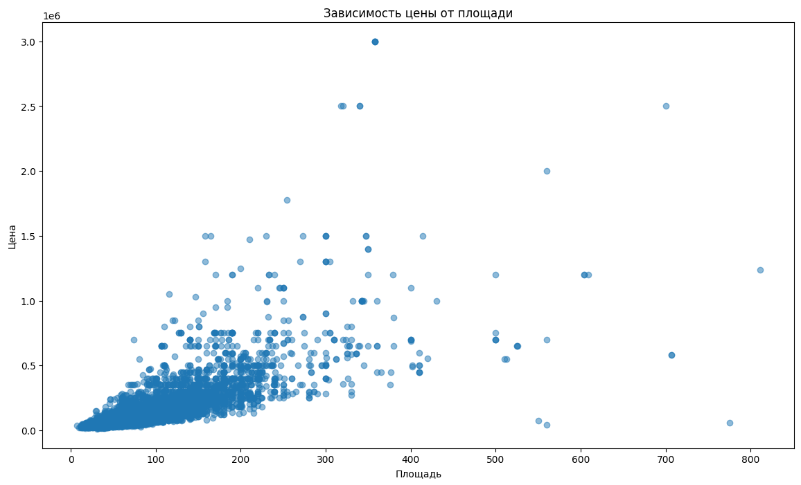
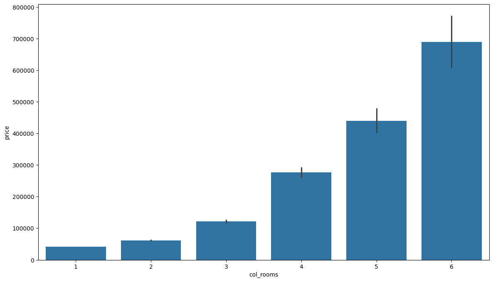
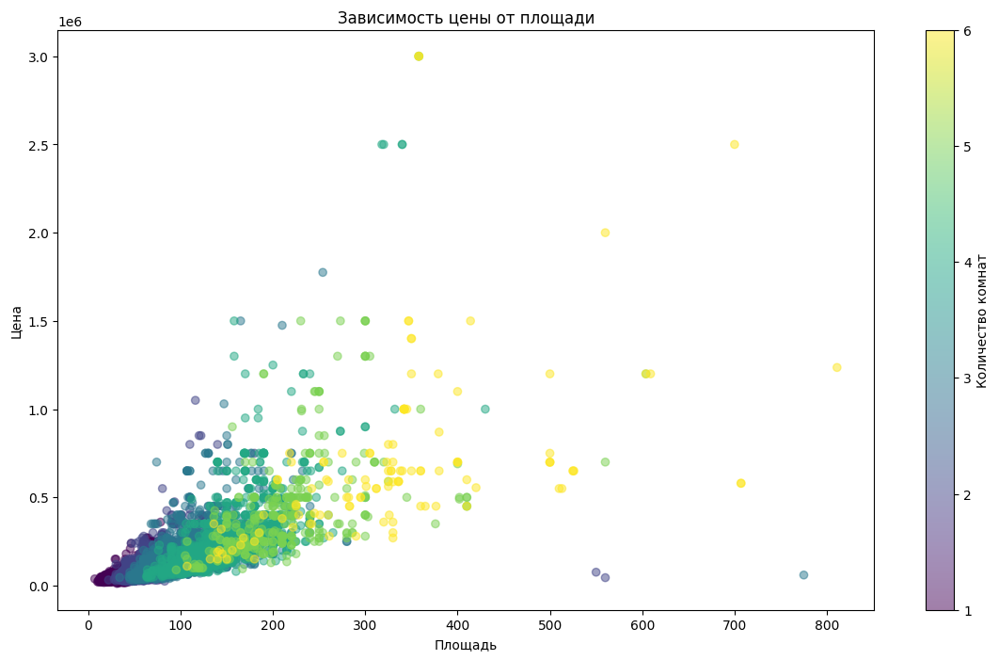
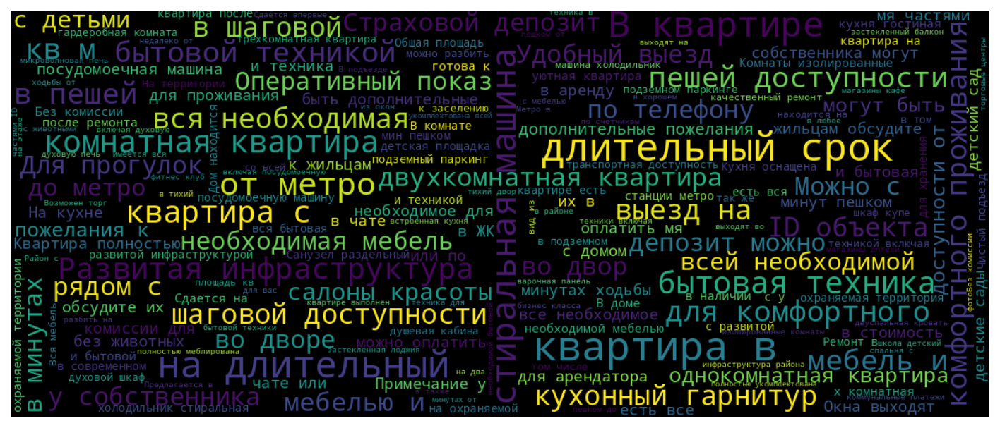

# real_estate_EDA

## Введение
Данный датасет содержит информацию о квартирах, доступных для аренды в городе Москва. Данные взяты из различных объявлений и включают разнообразную информацию о квартирах, такую как количество комнат, метро, адрес, площадь, дом, парковка, цена и другие характеристики.

## Структура датасета
Датасет представлен в виде таблицы, где каждая строка соответствует отдельному объявлению о квартире. Всего датасет содержит 19,714 строк и 24 столбца с различными характеристиками.

### Описание столбцов:

2. **ID объявления**: Уникальный идентификатор объявления.(останется без изменений)
3. **Количество комнат**: Количество комнат в квартире. (разделится на столбцы количества и категории(Изолированна, Оба варианта, Смежная))
4. **Метро**: Ближайшая станция метро. (разделится на название станции метро и время до нее пешком)
5. **Адрес**: Адрес квартиры. (изменится до названия улицы, возможно добавятся координаты)
6. **Площадь, м2**: Общая площадь квартиры. (соответственно общая площадь / жилая площадь / площадь кухни)
7. **Дом**: Информация о доме, в котором находится квартира.  (разделится на две колонки, два числовых и категориальный)
8. **Парковка**: Тип парковки.(категориальный)
9. **Цена**: Стоимость аренды в рублях.(разделится на цену аренды, Коммунальные услуги и срок(длительный/нет))
10. **Телефоны**: Контактные телефоны владельца или агента. (первые несколько цифр, отвечающие за регион станут категориальным признаком)
11. **Описание**: Дополнительная информация о квартире. (будут вычленены отдельные слова в категориальный признак их наличия)
12. **Ремонт**: Тип ремонта в квартире.  (категориальный)
13. **Площадь комнат, м2**: Площадь каждой комнаты в квартире. (возможно будет дропнут)
14. **Балкон**: Информация о наличии балкона. (категориальный)
15. **Окна**: Описание выхода окон. (категориальный)
16. **Санузел**: Тип санузла. (категориальный)
17. **Можно с детьми/животными**: Возможность проживания с детьми или животными. (категориальный)
18. **Дополнительно**: Дополнительные удобства в квартире. (разделить на категориальные признаки)
19. **Название ЖК**: Название жилого комплекса. (возможно будет дропнут)
20. **Серия дома**: Серия постройки дома. (непонятный, будет дропнут)
21. **Высота потолков, м**: Высота потолков в квартире. (числовой)
22. **Лифт**: Наличие лифта. (категориальный)
23. **Мусоропровод**: Наличие мусоропровода. (категориальный)
24. **Ссылка на объявление**: Ссылка на источник объявления. (будет дропнут)

## Шаги по работе над проектом
Понимание требований:  с поставленными задачами и требованиями к обработке данных.

1. Подготовка данных: Используя выгруженную таблицу, подготавливаем данные для анализа. Это включает в себя очистку данных, обработку пропущенных значений и преобразование категориальных переменных.

2. Анализ данных: Проведите анализ данных, чтобы понять особенности распределения стоимости аренды квартир в Москве, выбранном пилотном регионе. Рассмотрите различные характеристики квартир и их влияние на стоимость аренды.

3. Используемые инструменты и технологии
Python (библиотеки: pandas, numpy, matplotlib, seaborn)
Jupyter Notebook для анализа данных
Git для управления версиями кода и совместной работы

## Очистка данных
Датасет был предварительно обработан с использованием библиотек pandas и numpy. Операции по очистке включали в себя:

- Исключение строк с ценами в валютах, отличных от рублей.
- Оставление только объявлений из Москвы.
- Заполнение пропущенных значений в столбце "Количество комнат".
- Удаление столбца "Тип", так как он содержит одинаковые значения.

## Примеры данных
Приведены примеры нескольких строк из датасета для лучшего понимания его структуры и содержания.

1. **Количество комнат**: 4  
   **Метро**: м. Смоленская (9 мин пешком)  
   **Адрес**: Москва, улица Новый Арбат, 27  
   **Площадь, м2**: 200.0/20.0  
   **Цена**: 500,000 руб./ За месяц  
   **Описание**: Без комиссии для нанимателя! Бонус коллегам 12...  
   **Ремонт**: Дизайнерский  
   **Балкон**: NaN  
   **Окна**: NaN  
   **Санузел**: NaN  
   **Можно с детьми/животными**: Можно с детьми, Можно с животными  
   **Дополнительно**: Мебель в комнатах, Мебель на кухне, Ванна, Душ...

2. **Количество комнат**: 4  
   **Метро**: м. Смоленская (8 мин пешком)  
   **Адрес**: Москва, улица Новый Арбат, 27  
   **Площадь, м2**: 198.0/95.0/18.0  
   **Цена**: 500,000 руб./ За месяц  
   **Описание**: Лот 93107. Елена Анисимова...  
   **Ремонт**: Дизайнерский  
   **Балкон**: NaN  
   **Окна**: На улицу и двор  
   **Санузел**: Совмещенный (2), Раздельный (1)  
   **Можно с детьми/животными**: NaN  
   **Дополнительно**: Мебель в комнатах, Мебель на кухне, Ванна, Душ...

## Ссылки на объявления
Каждой строке в датасете соответствует ссылка на источник объявления, что позволяет получить дополнительную информацию или связаться с владельцем квартиры.

*Примечание: Все значения NaN в столбцах
 означают отсутствие информации или неопределенность в данных.*

# Визуализация данных

## Зависимость цены от площади и количества комнат

### Scatter Plot

На графике представлена зависимость цены аренды квартир от их площади. Цвет точек обозначает количество комнат в квартире (чем светлее, тем больше комнат). Видно, что с увеличением площади цена также увеличивается, что вполне ожидаемо. можно заметить что зависимость нелинейная (две аренды трехкомнатных стоят меньше чем одна шестикомнатная)

### Bar Plot

На столбчатой диаграмме представлено среднее значение цены для квартир в зависимости от их количества комнат. Можно заметить, что с увеличением количества комнат средняя цена аренды также увеличивается. Это может быть связано с большей общей площадью квартиры и удобствами, предоставляемыми квартирами с большим количеством комнат.

### Scatter Plot with Colorbar

На данном графике точки представляют квартиры в зависимости от их площади и цены. Цвет точек указывает на количество комнат в квартире (чем темнее, тем больше комнат). Этот график дополнительно демонстрирует, как количество комнат может влиять на цену и площадь квартир.

### Word Plot

На данном графике показаны часто встречаемые слова
