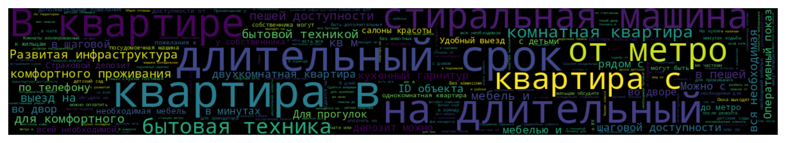
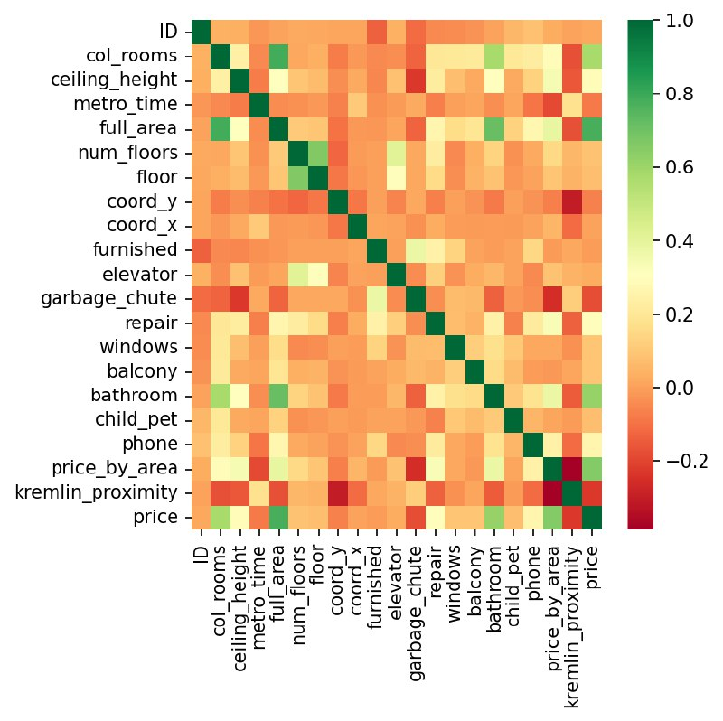

# Real estate

## Описание проекта

Данный датасет содержит информацию о квартирах, доступных для аренды в городе Москва. Данные взяты из различных объявлений и включают разнообразную информацию о квартирах, такую как количество комнат, метро, адрес, площадь, дом, парковка, цена и другие характеристики.

Наша задача подготовить данные для модели машинного обучения, которая будет оценивать квартиры и предлагать стоимость аренды максимально похожую на ту, которую выставляют люди.

## Структура датасета

Датасет представлен в виде таблицы, где каждая строка соответствует отдельному объявлению о квартире. Всего датасет содержит 19,714 строк и 24 столбца с различными характеристиками.

## Этапы работы над проектом

### 1. EDA (Exploratory Data Analysis) - Разведочный анализ данных

- Проверка на наличие пропущенных значений.
- Проверка на выбросы.
- Создание графиков для визуального изучения данных и выявления закономерностей.

### 2. Предобработка данных

Цель предобработки данных - получение качественного набора данных для последующего анализа или моделирования.

- Удаление ненужных столбцов.
- Заполнение пропущенных значений.
- Добавление новых значений на основе существующих.
- Удаление выбросов.
- Преобразование адреса в координаты с помощью библиотеки geopy.
- Фильтрация критерия "Цена" по валютному признаку.

### 3. Финальный коммит данных

- Более точная работа над выбросами.
- Оценка коэффициента корреляции между признаками.
- Проверка на дублированные объявления.
- Формирование и удаление нового признака "Средняя цена по улице аренды за кв.м." на основе координат.
- Анализ данных на основе станций метро: район и административный округ.

### график с корреляциями датасета

## Используемые инструменты и технологии

- Python (библиотеки: pandas, numpy, matplotlib, seaborn)
- Jupyter Notebook для анализа данных
- Git для управления версиями кода и совместной работы.

